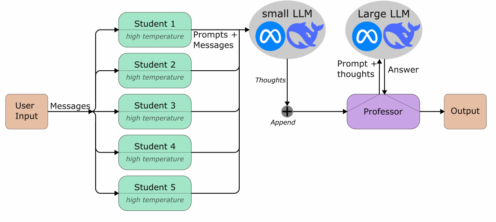

# [Ensemble]

## Overview

The Ensemble architecture relies on multiple LLMs. A smaller model (student) generates rich context using a high temperature coefficient (adjust for optimal results) and a larger LLM answers the users question based on the highly variable context provided by the student. As the smaller model can easily be parrallelized, increasing the number of LLM calls does not increase the runtime.

## Architecture Diagram

