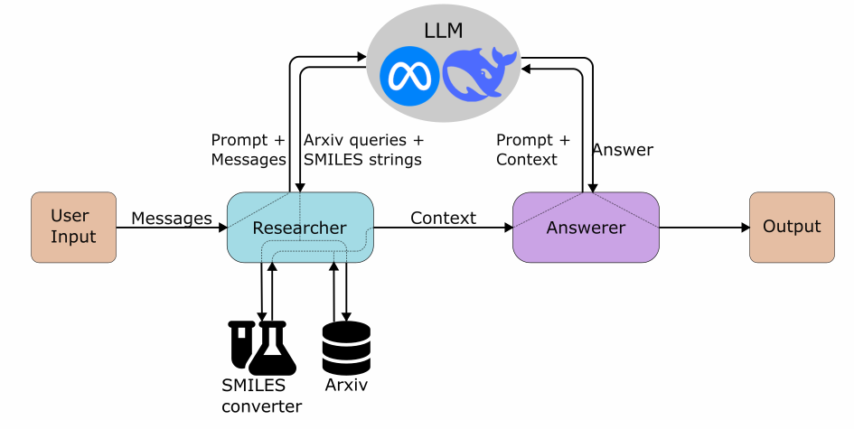

# [Ensemble]

## Overview

The RAG architecture relies on external knowledge. By composing queueries for the databases it has access to it produces context tailored for the users question and then answers based on this context.

## Architecture Diagram

