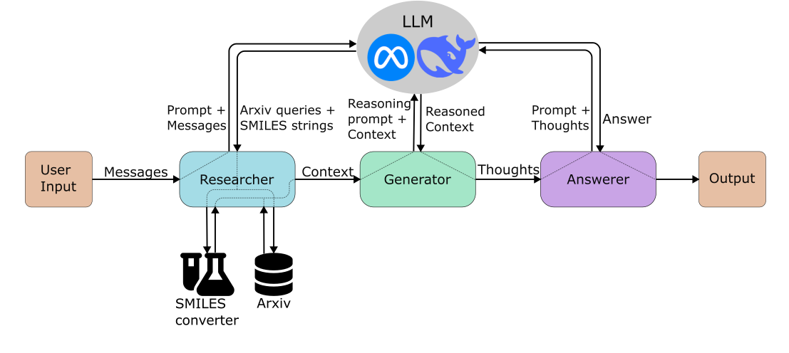

# [Ensemble]

## Overview

The RAG Reasoning architecture is a streamlined all-in-one approach. It utilizes external knowledge databases to generate context and includes an interim LLM-call to elevate the reasoning capabilities of the final answer.

## Architecture Diagram

