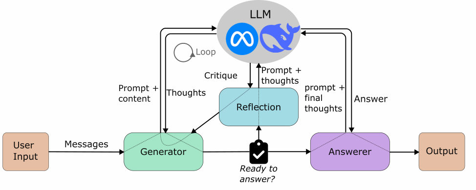

# [Ensemble]

## Overview

The Reasoning architecture relies on multiple, iterative calls of the LLM. In a loop it generates thoughts, reflects upon them and finally answers the users questions based on that. 

## Architecture Diagram

